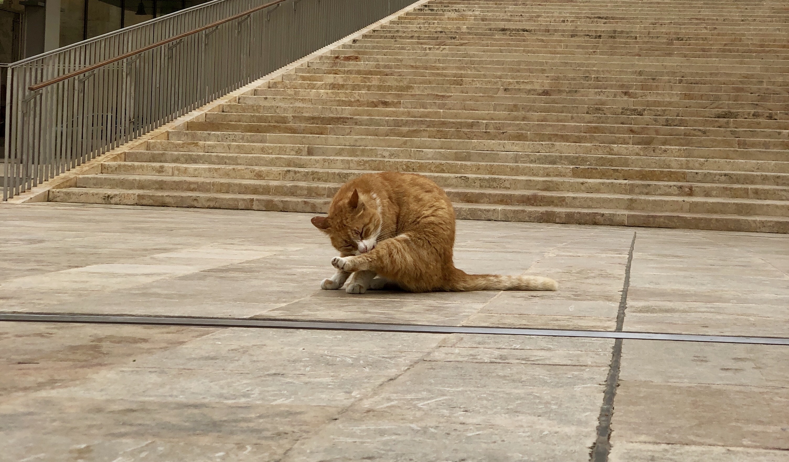

2019年から続く限り書く習慣を身に付けたいと思う。
2月は英語学習に集中していたため単純に本を消化するような読み方をしていたので3月は読んだ内容をアウトプットしていきたい。

###2月読んだ本リスト
1. ガウディの伝言 外尾悦男
2. 筋トレが最強のソリューションである testosterone
3. フランシス・ベーコンインタビュー

ざっくり振り返るとガウディの伝言は「ガウディの人物像を知るだけでなく、なぜサグラダファミリアが未完成の傑作と呼ばれるのか、また近年その建築スピードが飛躍的に上がっているその背景と建築家たちの意志をリアルに感じ取ることができて面白かった。testosteroneさんの本を読んで筋トレしたくならない人はいないと思う。フランシス・ベーコン インタビューは芸術家としての彼の哲学を感じ取れる内容で何度も読み返したい内容だった。

###3月リスト
1. Atomic Habits
2. 論語と算盤 渋沢栄一
3. 実践行動分析 入門 リチャードセイラー

###読めたら読む
1. 文章を整える技術 下良果林
2. Principles Ray Dalio

Atomic Habitsは以前から読んでみたいと思っていたので英語を学んだこの機会に精読して自分の身にしたい。
Atomic Habitsは僕の好きなYoutuberがおすすめしていた本で、ざっくりした内容はSummary Atomic Habitsという要約本を読んで理解したつもりになったけど、結局原本を読まないと自分のみになるようなエッセンスは身につかないかなと思ったので英語を学んだこの機会に1から読んでみようと思う。あと、リスニングの勉強も兼ねてAudible版も買ってみた。 Audibleでは著者本人が朗読してくれるのでなんか臨場感もあるしモチベーションの維持に繋がりそうな気がする。

###まとめ
もしこの記事を読んでいる人の中で、「自分もこの本を読んだ」という人や一緒に読書会とかしてみたいと思ってくれる 優しい方いましたら是非気軽にDMお待ちしております！

