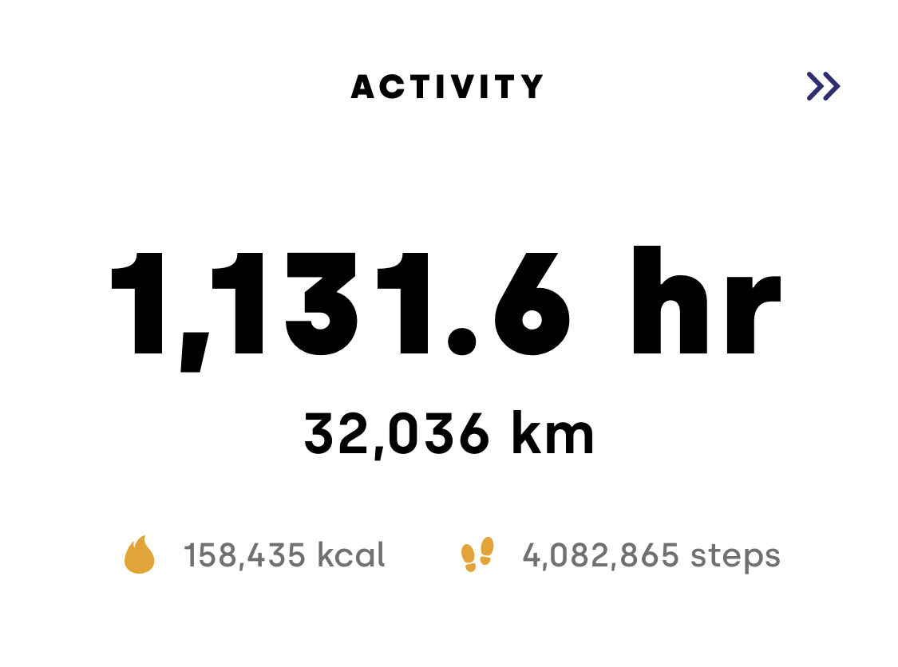

画像は2019年のアクティビティと合計時間

### 2019の振り返り
2019年は、約1ヶ月半の留学とヨーロッパ周遊、大学卒業と同時に新卒として働くという環境が目まぐるしく変化する一年でした。 振り返ってみると様々なことに挑戦させていただける今の環境に充実感を感じつつも、それに付随するプレッシャーと追いついていない自分の能力とのギャップに苦しんだ1年でもありました。 

### 2020のテーマ『可動域の拡張』
可動域
> 何かの物体や部品、または身体の一部が、問題なく動くことのできる範囲や角度などを意味する表現。

「可動域」という言葉がこの使い方で合っているのか若干疑問があるところですが、他に良い言葉が見つからないので使わせてもらいました。 (2019年は「伝える力の向上」というテーマでした。) 
僕が思うに、人間の能力や影響を及ぼせる範囲にはそれぞれ関節のように点となる位置があってそこをどれだけ動かせるか、もしくは点を増やせるかによって新しい影響の輪を広げていけるような気がしています。 2020年は去年感じたプレッシャー等のハードな差を乗り越えつつも、少しでもこの可動域を拡げられるような年にしていきたいです。 

### テーマのためにやること3ヶ条
1. 業務に関わる専門知識を身につける← NEW
2. 時間の使い方を見極める← NEW
3. ログを残す

業務だとデジタルマーケティングに関する知識をより体系的に学ぶこと、まだ全ての業務に通じると思っている、より深い分析と能率を向上させるために必須 (筆者はそう思う) のアルゴリズムの学習、また英語も引き続き勉強していきます。 また、これらを行うためには必然的にこれまでの生活+αの時間を捻出しなければならないため「何に時間を使うのか」を考えて行動する必要があります。「3. ログを残す」は前年と引き続き今年の3ヶ条として加えました。ログを残すことで「今年何が合ったのか、できるようになったのか」を目に見える形で残すことができるからです。 具体的にはArcというアプリでの位置情報とアクティビティのトラッキング、メモや読書記録の習慣などを継続してログにしていきます。

### やらないこと3ヶ条
1. 夜更かしをしない
2. 健康を害するものを極力食べない
3. 必要以上に多くを語らない

やることと一緒にやらないことを決めることも大事です。必要最低限考える力を保つためにも夜更かしをせず、身体に悪いと個人的に思っている糖や乳製品などの摂取は極力控えます。 また、今年はSNS等からは適度な距離を置き、考える時間を作ったり、やるべきことに時間を当てます。

https://twitter.com/year_progress/status/1213490270412722176

今年も既に4/365は終了しており、何も考えないまま日々を過ごしているとおそらくまた一瞬で1年が終わるんじゃないでしょうか。今年は「今年はアレとアレやったな。良い年だった。」と少しでも振り返った時に道が残るよう、積極的にブログも残していく所存です。 あと社会人になってから合ってない人、ぜひご飯いきましょう🍚 。