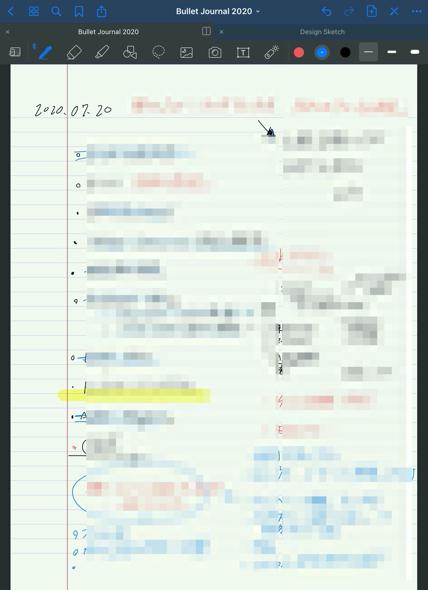
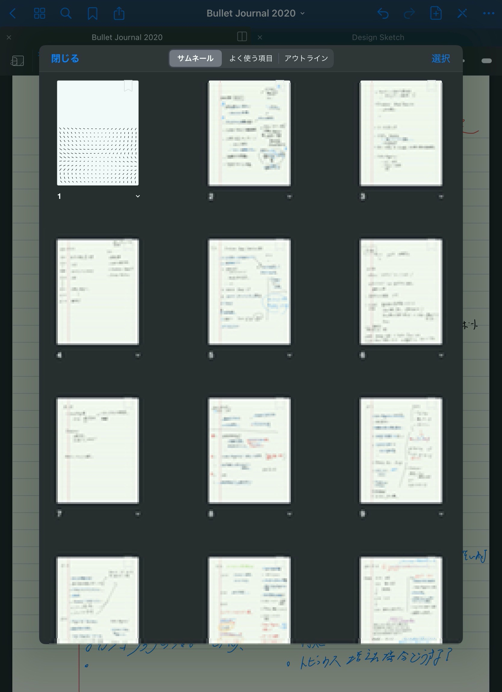

## iPad Pro + Good Notes 5 + Bullet Journal = 約束された勝利の板

これまで様々なタスク管理術をアプリやノート術で試してきたが、その中でもとりわけ長くしっくりきていたものに「Bullet Journal」というノート術がある。「基本的に自由に何でも書いて良い」という点がズボラな自分にピッタリだった。自分の生産性を上げるうえで「最も重要なことに集中する」ことはどんなことよりも大切で、それ以外の優先度が低いタスクはノートに書き出しておくことで忘れ、いま集中すべきことに脳のリソースを割くためにも、箇条書きベースで効率的に記載をするノート術は、これまでのどのタスク管理よりも自分にワークしていた。

ただ、手元に紙を置いておかなかったり移動中にふと思い出したタスクを入れたくなる時に手元にノートが無いという場面が何度かあってしばらく使っていなかったのだけど、先日Good Notes 5というアプリを購入した際にこのアプリがあればBullet Journalも継続できるのでは？と思い立ち試してみたところ、すこぶる良く、二ヶ月程度続いているのでその方法をログとしてのことしておきたい。
  

## そもそもBullet Journalとは

<iframe style="width:120px;height:240px;" marginwidth="0" marginheight="0" scrolling="no" frameborder="0" src="//rcm-fe.amazon-adsystem.com/e/cm?lt1=_blank&bc1=FFFFFF&IS2=1&bg1=FFFFFF&fc1=000000&lc1=0000FF&t=gaaasuu-22&language=ja_JP&o=9&p=8&l=as4&m=amazon&f=ifr&ref=as_ss_li_til&asins=B07Q26SF5P&linkId=8dfcd24b317cf0961768f236f28cba35"></iframe>

Bullet Journalの教科書といえば↑の本になるが、正直要点さえ押させておけば、わざわざ本を買って読む必要もないと思う。また、WebサイトやYouTubeでもその概要は抑えておいても良いだろう。
<iframe width="560" height="315" src="https://www.youtube.com/embed/fm15cmYU0IM" frameborder="0" allow="accelerometer; autoplay; encrypted-media; gyroscope; picture-in-picture" allowfullscreen></iframe>

**私が思うBullet Journalのポイント**

1. ページはすべてインデックスで管理する
2. Todoはすべてフューチャーログ / マンスリーログ / デイリーログの3つで管理する
3. 記号とカスタムバレットを使いこなして効率よく記録する
4. **システムは自分で作り変えていく**

4つ目の項目が最も重要だと思ったので太字にしておいた。Bullet Journalという名前はついてはいるが、要はノートのとり方を工夫するだけのことではあるので、あまり方法やルールに拘る必要はなく自分がやりやすい方法にアップデートしていくのが良いし、このノート術もカスタマイズを推奨している。

このノート術をiPad Proで運用してくにあたって、Good Notes 5というノートアプリにも触れておきたい。    
    

## Good Notes 5を選んだ理由

iPadの手書き系ノートアプリといえば、純正のメモアプリかGood Notes 5、Notabilityあたりを選ぶ人が多いと思うが、とりわけBullet JournalにおいてはGood Notes 5が最も運用には向いている。使ってみればわかるが、Good Notes 5は横にスワイプすることでノートの追加や移動が可能で、より紙のノートに近い使い方ができるのに対して、NotabilityやAppleのメモアプリがノートの1ページを縦に追加していく形になっており、よりタイピングでの文字追加等に対応したデジタルでの使い方に特化した構造になっている。 Bullet Journalにはもともとインデックスで管理していく方法をとっているので、より紙に近い運用をしていくにはGood Notes 5を使うのが無難だと思う。

※似たようなページが横に展開していくノートアプリに「Notability」があるのでそちらでも運用は可能だだと考えられるが、私は試したことがないし、個人的に機能や検索性の面でGood Notes 5に勝るアプリはないと思っている。  

## デイリーログは一箇所にまとめておく

  

日々のTodoはデイリーログにまとめる。こちらは紙ノートに書いていたときと同じように、一日一ページを目安にTodoや時間帯ごとのスケジュールをBullet（箇条書き）でまとめていく。私の場合、これ以外にも日々その日のうちに必ず終わらせたい仕事や日課を「ハイライト」としてページの頭に赤字で記載している（こちらは「時間術大全」という本に書かれている方法を参考にしているので気になる方は↓にリンクを参照）。また、終了したタスクに関しては青字で文字の上から削除線を引いて終わったかどうかをより視覚的にわかりやすくしている。紙のノートだと色分けとか面倒でつい同じ色のボールペンで完結しがちだが、Apple Pencilには多機能ボールペン以上の機能が備わっているので、そういった色使いの面でも紙ノートから移行した価値があるように感じる。余談だが、自分はいつも寝る前に明日の予定をこのデイリーログに書いて、朝当日のスケジュールを見て慌てることがないように準備をしている。

<iframe style="width:120px;height:240px;" marginwidth="0" marginheight="0" scrolling="no" frameborder="0" src="//rcm-fe.amazon-adsystem.com/e/cm?lt1=_blank&bc1=000000&IS2=1&bg1=FFFFFF&fc1=000000&lc1=0000FF&t=gaaasuu-22&language=ja_JP&o=9&p=8&l=as4&m=amazon&f=ifr&ref=as_ss_li_til&asins=B07SD3F145&linkId=873f5eae99145c443cdd86ae38428780"></iframe>

 
 

## マンスリーログやプロジェクトはアウトラインに追加
未来の大事な予定を書き込むフューチャーログや、直近1〜2ヶ月間の予定を日毎に書き込むマンスリーログもGood Notes 5に落とし込んでいく。これらの未来のスケジュールを事前に書いておくと、紙ノートの場合どのページに記載していたか忘れがちになっていたのだが、Good Notes 5には重要なページを「アウトライン」という目次の役割を担う機能に登録しておく事ができるので、どこに記録していたか迷うことなく直ぐに該当ページを開くことができる。これまでわざわざ紙ノートにページを書いて忘れないようにしていたBullet Journalistにとって、この機能は紙から乗り換えたくなるほど優れ機能であることが伝わってくれたら嬉しい。

 
 

## 他のデバイスから参照する

紙のBullet Journalをやめた理由の一つに、パッとメモをしておきたい時に手元にノートを持っていないことが多い。というのも上げたが、デジタルデバイス（少なくともApple製品）の場合、ポケットにスマホは必ず入っているので、そこからGood Notes 5にアクセスしてテキストベースで残しておくこともできる。iCloud同期がデフォルトで備わっているので、オンにしておくだけでシームレスにBullet Journalをどこでも参照できるのがデジタルの良いところ。ただし、自動同期には少々タイムラグがあるのでもし事前のノートが反映されていないときはおとなしく別のアプリに残して、後で参照してiPadから書き直したりするときもある。 ちなみにGoogle Driveの自動同期も対応しているのでWindowsやAndroidを使っている人はそちらから参照するほうが良いかもしれない。
 
 

## まとめ

紙の手触り感や書き心地など、アナログでなければ感じるほうが良い場面もあるが、私個人の意見としては、大抵のメモ書きなどはiPad Proで事足りるようになってきた。また、これからiPadの購入を考えている人には、Apple Pencilの使い勝手を考慮して、iPad Pro 2019年移行のモデルを購入することを強くおすすめする。　iPad Pro布教委員会として今後も便利な使い方を思いついたらブログとかでシェアしていきたい。
 
 
