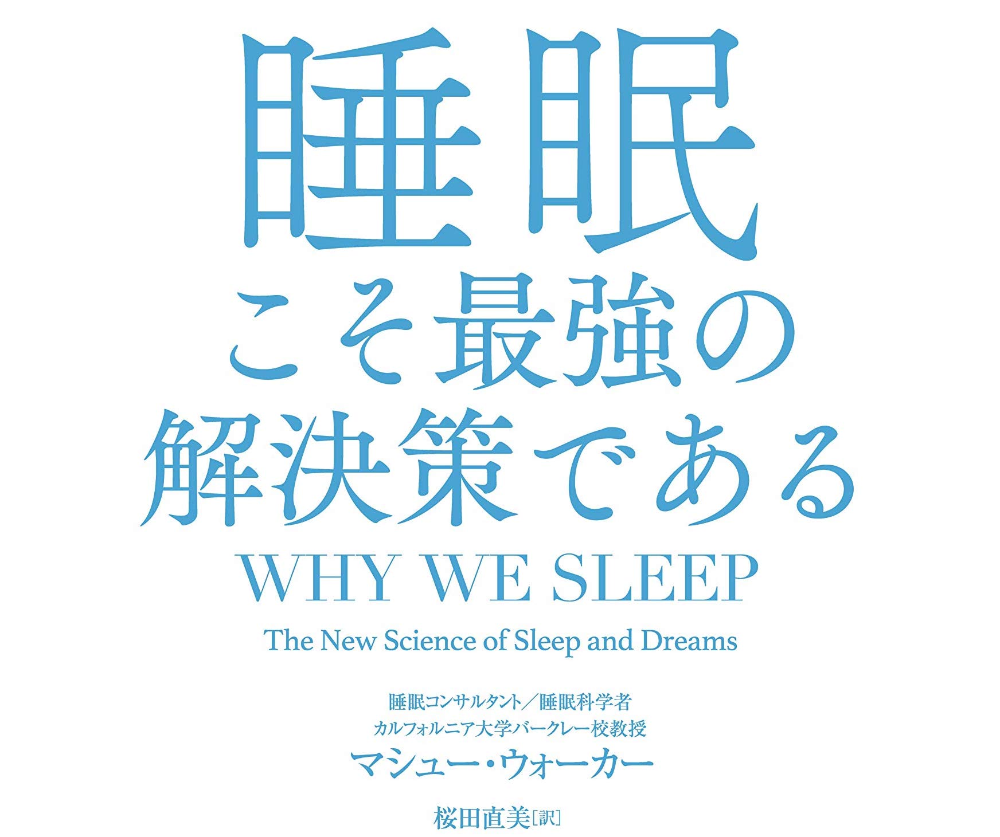

Book Review: 睡眠こそ最強の解決策である  

著者: Matthew Walker  
原著: Why We Sleep: The New Science of Sleep and Dreams  
URL: [https://amzn.to/30bDqsY](https://amzn.to/30bDqsY) 
 
今のところ今年一読んで良かった本になります。
巷には「どうしたらより良い睡眠が取れるのか？」という内容にフォーカスした睡眠本が多いなか、この本は「なぜ人間には睡眠が必要なのか？」という視点から睡眠の本質とその効果を解説してくれています。  
そしてその内容も睡眠不足による自動車事故の例から思春期の悩みに至るまで様々な角度から取り扱われており、結果としてどの睡眠ハック本よりもわかりやすくその必要性を説いてくれています。 たぶん、どの内容も一度は
原著の「Why We Sleep」というタイトルが非常に明快に本の内容を著しているため、日本語版の表紙がどうしてここまで胡散臭くなってしまったのか疑問ですが、睡眠に関して一度は悩んだことがある人はぜひ読んでみることをお勧めします。  
 あと購入する前にamazonの詳細欄が本書の良い要約がなされているので読む前に参考にすれば良かったなと思いました。
 

【要約】  
1. 人には「昼寝」をするための生物学的な習慣がある (二相睡眠)  。
2. 人間はノンレム睡眠で情報を整理し、レム睡眠で情報を統合する
3. ヒトの進化の過程で睡眠時間が凝縮され、レム睡眠が増えたおかげで複雑な脳をもった。
4. 思春期の夜更かしと朝寝坊は生物学的に当然のこと (該日リズムのスケジュールが大人よりはやい)。
5. 慢性的な睡眠不足が続くと気性、認知力、学業成績などの面でADHDの症状と酷似してくる
6. 全ての種族は失われた睡眠 (睡眠負債) を一度に取り戻すことはできない。
7. 大切なことは継続的に十分な睡眠をとること (Avg. 7~9時間程度)